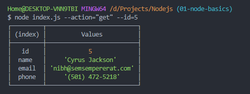
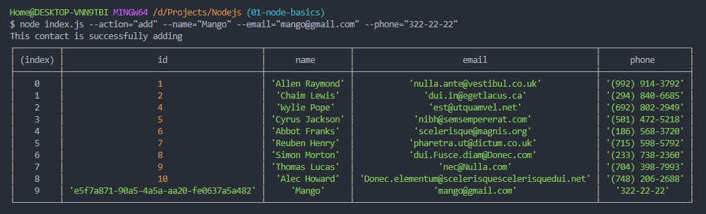
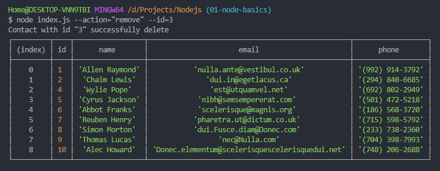

# nodejs-homework
homework-01
----------------------------
### Reference to task 
+ https://github.com/goitacademy/nodejs-homework/blob/master/homework-01/README.md

### Получаем и выводим весь список контакстов в виде таблицы (console.table)
#### node index.js --action="list"

### Получаем контакт по id
#### node index.js --action="get" --id=5

### Добавялем контакт
#### node index.js --action="add" --name="Mango" --email="mango@gmail.com" --phone="322-22-22"

### Удаляем контакт
#### node index.js --action="remove" --id=3

